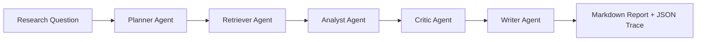

# MADNet Research Agent

MADNet Research Agent is a verification-friendly multi-agent research assistant prototype for remote sensing video super-resolution (VSR). This repository is intentionally structured for public review: it states the core pain point, exposes the long-chain reasoning workflow, and includes demo code, trace artifacts, and CI configuration that make the project easy to inspect.

## Project Snapshot

This project targets a common research bottleneck in remote sensing VSR: papers, degradation assumptions, datasets, and metrics are scattered, which makes synthesis slow, repetitive, and difficult to validate. The system addresses that by converting a manual research loop into an auditable multi-agent workflow with explicit intermediate state.

Chinese design notes are documented in [docs/DESIGN_CN.md](docs/DESIGN_CN.md).

## Core Pain Point

In remote sensing VSR research, a large amount of time is lost in repeated manual work:

1. Searching scattered papers and notes.
2. Comparing methods built on inconsistent degradation assumptions.
3. Extracting datasets, metrics, and evaluation settings by hand.
4. Re-checking whether the final written conclusion is actually supported by evidence.

This project turns that fragmented workflow into a structured agent pipeline that can be inspected, replayed, and extended.

## Core Logic Flow

The prototype uses explicit long-chain reasoning with multi-agent state handoff:



- `Planner Agent`: decomposes the research question into sub-goals and focus dimensions.
- `Retriever Agent`: recalls relevant evidence from a local sample corpus.
- `Analyst Agent`: extracts comparable signals such as method, degradation, dataset, and metric.
- `Critic Agent`: checks for unsupported claims, evidence gaps, and bias risks.
- `Writer Agent`: generates a reviewer-friendly report and a machine-readable trace.

This design is more suitable for research scenarios than a single one-shot answer because the reviewer can inspect not just the final output, but also the path that led to it.

## Why This Is Useful For Review

- The repository clearly states the problem being solved.
- The agent workflow is separated into auditable stages instead of one opaque response.
- The project includes both source code and example reasoning outputs.
- The CI workflow can be used as a lightweight reproducibility hook.
- The expanded codebase now includes state models, evaluation, prompts, sample questions, and tests.

## MIMO-Oriented Summary

For application review, the project demonstrates two concrete capabilities:

1. `Agent-driven problem decomposition`
   The system does not respond directly to the raw question. It first breaks the problem into research sub-goals and analysis dimensions.
2. `Long-chain multi-agent collaboration`
   The workflow contains sequential collaboration across planner, retrieval, analysis, critique, and writing stages, with explicit intermediate state transfer and final trace output.

The direct application text is available in [docs/MIMO_APPLICATION_TEXT.md](docs/MIMO_APPLICATION_TEXT.md).

## Repository Layout

```text
.
|-- .github/workflows/demo.yml
|-- data/sample_corpus.json
|-- docs/
|   |-- ARCHITECTURE.md
|   |-- DESIGN_CN.md
|   |-- MIMO_APPLICATION_TEXT.md
|   |-- PROJECT_HIGHLIGHTS.md
|   |-- ROADMAP.md
|   `-- VERIFICATION.md
|-- madnet_research_agent/
|   |-- __init__.py
|   |-- agents.py
|   |-- corpus.py
|   |-- cli.py
|   |-- evaluation.py
|   |-- models.py
|   |-- prompts.py
|   |-- reporting.py
|   `-- workflow.py
|-- main.py
|-- outputs/
|   |-- example_report.md
|   |-- example_summary.json
|   `-- example_trace.json
|-- tests/
|   |-- test_agents.py
|   `-- test_workflow.py
`-- pyproject.toml
```

## Quick Start

Python 3.11+ is enough. No third-party packages are required for the demo.

```bash
python main.py --question "What are the open issues in remote sensing VSR?"
```

After running, the project writes:

- `outputs/latest_report.md`
- `outputs/latest_trace.json`

The repository also includes reviewer-friendly reference artifacts:

- `outputs/example_report.md`
- `outputs/example_summary.json`
- `outputs/example_trace.json`

## Verification

Reviewers can verify the project in four steps:

1. Read [docs/PROJECT_HIGHLIGHTS.md](docs/PROJECT_HIGHLIGHTS.md) for a concise project summary.
2. Read [docs/DESIGN_CN.md](docs/DESIGN_CN.md) or [docs/ARCHITECTURE.md](docs/ARCHITECTURE.md) for the design.
3. Read [docs/MIMO_APPLICATION_TEXT.md](docs/MIMO_APPLICATION_TEXT.md) for the application-ready wording.
4. Inspect `tests/` and `data/research_questions.json` to see that the project is more than a one-file demo.
5. Run the demo locally or inspect `.github/workflows/demo.yml`.

Detailed verification instructions are documented in [docs/VERIFICATION.md](docs/VERIFICATION.md).

## Positioning

This repository is a public research-agent prototype rather than a production system. Its primary value is that it makes the workflow easy to explain, easy to verify, and easy to extend when connected to a real model, paper database, or experiment tracking stack.
