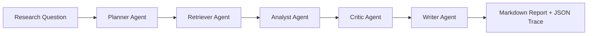

# MADNet Research Agent

MADNet Research Agent is a verification-friendly prototype for a multi-agent research assistant focused on remote sensing video super-resolution (VSR). It is designed for public review: the repository explains the problem it solves, the long-chain reasoning workflow it uses, and includes a small runnable demo plus a GitHub Actions workflow.

## What pain point it solves

Remote sensing VSR research is hard to scale manually because the work is fragmented across paper retrieval, degradation analysis, experimental setting comparison, evidence tracking, and conclusion writing. In practice, researchers spend a lot of time repeating the same loop:

1. Search for scattered papers and notes.
2. Compare methods with inconsistent assumptions.
3. Extract datasets, metrics, and degradation settings by hand.
4. Re-check whether the final conclusion is actually supported by evidence.

This project turns that slow and error-prone loop into a structured agent workflow that can be inspected and replayed.

## Core logic flow

The prototype uses long-chain reasoning with explicit state handoff across multiple agents:



- `Planner Agent`: decomposes a research question into sub-goals.
- `Retriever Agent`: recalls relevant evidence from a local sample corpus.
- `Analyst Agent`: extracts method, degradation, dataset, and metric signals.
- `Critic Agent`: checks for evidence gaps, unsupported claims, and bias risks.
- `Writer Agent`: produces a review-ready report and a machine-readable trace.

The included demo is intentionally lightweight and uses a local sample corpus so the workflow can be verified without external APIs. The structure is ready to be replaced with real LLM calls or retrieval backends later.

## Repository layout

```text
.
|-- .github/workflows/demo.yml
|-- data/sample_corpus.json
|-- docs/
|   |-- ARCHITECTURE.md
|   |-- MIMO_APPLICATION_TEXT.md
|   `-- VERIFICATION.md
|-- madnet_research_agent/
|   |-- __init__.py
|   |-- agents.py
|   |-- cli.py
|   `-- workflow.py
|-- main.py
`-- pyproject.toml
```

## Quick start

Python 3.11+ is enough. No third-party packages are required for the demo.

```bash
python main.py --question "What are the open issues in remote sensing VSR?"
```

After running, the project writes:

- `outputs/latest_report.md`
- `outputs/latest_trace.json`

The repository also includes reference artifacts for reviewers:

- `outputs/example_report.md`
- `outputs/example_trace.json`

## Verification

Reviewers can verify the project in three ways:

1. Read [docs/ARCHITECTURE.md](docs/ARCHITECTURE.md) for the multi-agent reasoning design.
2. Read [docs/MIMO_APPLICATION_TEXT.md](docs/MIMO_APPLICATION_TEXT.md) for the application-ready project summary.
3. Run the demo locally or inspect the GitHub Actions workflow in `.github/workflows/demo.yml`.

Detailed verification steps are documented in [docs/VERIFICATION.md](docs/VERIFICATION.md).

## Positioning

This repository is best understood as a public research-agent prototype rather than a finished product. Its purpose is to make the workflow easy to inspect, easy to explain, and easy to extend when connected to a real model, paper database, or experiment tracking stack.
